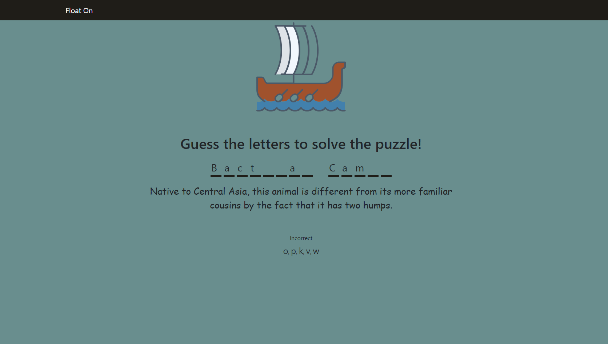
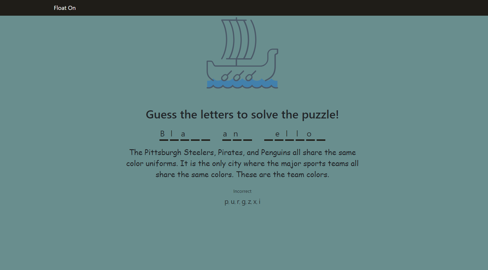

# Float On

## Can you solve the puzzle and float on to paradise? 

### Or will you be sunk at sea...

Guess the letters in the answer to solve the puzzle and float on! If the puzzle 
is not solved in eight (8) guesses or less, your ship will sink, and you will not
float on to paradise

Play Now!

keyboard required

Open [HERE](https://bramey-git.github.io/float-on/) to play.

Over 125 Puzzles across 6 categories and growing! Puzzles range from easy to 
difficult and are sure to teach you something new. Well, unless you are already
the greatest useless trivia mind to exist, then it may be a fun exercise...

Good Luck!

A Project By B Ramey

##### Available Scripts

`npm start`

Runs the app in the development mode.\
Open [http://localhost:3000](http://localhost:3000) to play it in your browser.

Play Now!

keyboard required

Open [HERE](https://bramey-git.github.io/float-on/) to play.
