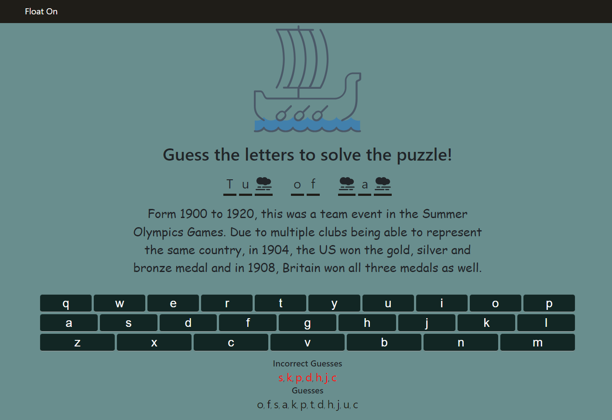

# Float On

## Can you solve the puzzle and float on to paradise?

### Or will you be sunk at sea...

You have eight (8) guesses to Guess the letters in the answer to clear the clouds
and solve the puzzle.

Play Now!

[Click Here](https://bramey-git.github.io/float-on/) to play.

Over 125 Puzzles across 6 categories and growing! Puzzles range from easy to
difficult and are sure to teach you something new. Well, unless you are already
the greatest useless trivia mind to exist, then it may be a fun exercise...

Good Luck!

A Project By B Ramey

##### Available Scripts

`npm start`

Runs the app in the development mode.\
Run in a node environment.\

Open [http://localhost:3000](http://localhost:3000) to play it in your browser.

Play Now!

[Click Here](https://bramey-git.github.io/float-on/) to play.

